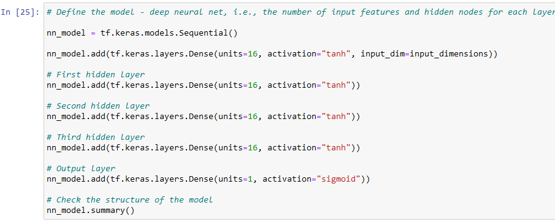

<body class="c15 doc-content">

Charity Funding Predictor Report
<h1 class="c10 c17" id="h.g6xehmypjmbs">Overview&nbsp;</h1>
AlphabetSoup is a non-profit organisation, which allocates funding to applicants. The purpose of this project was to build a tool to help in the decision making process, and predict, based on the available features, with upwards of 75% success, whether an applicant for funding would successfully make good use of it. To implement this, I created and trained an artificial neural network (NN) on prior data. 
<h1 class="c17 c10" id="h.dgqbxiwybu5x">Results: </h1><h2 class="c5 c10" id="h.a6cbxcc1g0w1">Data Preprocessing</h2>
The IS_SUCCESSFUL column is the target variable for the model, featuring only binary values of 0 and 1.

The feature variables for the model are:
<ul class="c16 lst-kix_g1iozmbsrt02-2 start"><li class="c1 li-bullet-0">APPLICATION_TYPE&mdash;Alphabet Soup application type</li><li class="c1 li-bullet-0">AFFILIATION&mdash;Affiliated sector of industry</li><li class="c1 li-bullet-0">CLASSIFICATION&mdash;Government organization classification</li><li class="c1 li-bullet-0">USE_CASE&mdash;Use case for funding</li><li class="c1 li-bullet-0">ORGANIZATION&mdash;Organization type</li><li class="c1 li-bullet-0">STATUS&mdash;Active status</li><li class="c1 li-bullet-0">INCOME_AMT&mdash;Income classification</li><li class="c1 li-bullet-0">SPECIAL_CONSIDERATIONS&mdash;Special consideration for application</li><li class="c1 li-bullet-0">ASK_AMT&mdash;Funding amount requested</li></ul>
EIN&nbsp;and NAME are identifiers and not relevant for classifying the data; they are neither targets, nor features, and should be removed.
<h2 class="c5 c10" id="h.ww82biq62bj6">Compiling, Training, and Evaluating the Model </h2>I initially chose two hidden layers, with eight neurons in each layer, and a Relu function in each case. </h2><h2 class="c5 c10" id="h.6e555qp7kuer">This is because I wanted to start fairly small, knowing that I could increase it later if necessary, but because the data had a large number of inputs,   and some numerical columns (e.g. &lsquo;ASK_AMT&rsquo;) &nbsp;had a large number of values,&nbsp; I did not want to start too small; i was expecting to have to increase these after a first pass. However, my score on unseen data was only 72.6%, so I did not meet the 75% threshold on this first pass.</h2>
I then began to take steps to optimise the data.

My first thought was to increase the number of hidden layers by one: As that did not improve the accuracy, I increased the number of neurons in each layer:

 As that also did not improve accuracy, I changed the function from relu to tan:

 None of this improved the performance on the model at all, leading me to two more potential improvements: firstly to further process the data, and secondly to allow tensorflow to auto-tune the NN model.

I therefore wrote a method to throw out outliers in the data, given defined parameters and went through each column, choosing a cut-off level for outliers, and removing them. This reduced some columns to only one variable, rendering them pointless, so they were dropped.

I decided also to try to reduce noise in the data by reducing the two numerical columns into bins (or fewer bins)  All of these simplifications combined reduced the number of input dimension from 49 to 35.

I decided to use the TensorFlow library to automatically optimise the hyper parameters on this simplified dataset, rather than continuing to guess at parameters myself.resulting in a best score of 72.6% - barely any better than any of the other models I had already trained. 

Due to this lack of improvement, I had tried increasing the number of neurons per layer from 30 to 100; I saw no further improvement.

I decided to see what would happen if I used tensorflow just on the original set of data; it still performed no better.

There was one last modification to the data set I tried: keeping in the &lsquo;NAME&rsquo; column rather than removing it at the start (optimise_tensorflow_keep_NAME.ipynb). 

With this as the only filter different from the default, the NN went on to achieve a satisfying 80% accuracy. However, I find it deeply unethical to include such an identifier as training data, as the model is effectively just learning to stereotype the data based on keywords in the name of the applicant. This reminds me of experiments measuring racial discrimination in the labor market such as &ldquo;Are Emily and Greg More Employable than Lakisha and Jamal? A Field Experiment on Labor Market Discrimination&rdquo; by Marianne Bertrand&nbsp;&amp;<a class="c8" href="https://www.google.com/url?q=https://www.nber.org/people/sendhil_mullainathan&amp;sa=D&amp;source=editors&amp;ust=1659797842838147&amp;usg=AOvVaw3NH5i2WdaAysC2qk4XC4Fa">&nbsp;</a>Sendhil Mullainathan (<a class="c8" href="https://www.google.com/url?q=https://www.nber.org/papers/w9873&amp;sa=D&amp;source=editors&amp;ust=1659797842838527&amp;usg=AOvVaw1Dlw-rjGLfFoQXOzWYeZ0i">https://www.nber.org/papers/w9873</a>).
<h2 class="c5 c10" id="h.4u7jjb55kocb">Summary: </h2>
Overall, I&rsquo;m happy that I was close to the required value, which is still significantly better than random, but perhaps the data are just too noisy to be perfectly predictable. This is understandable, as the realistic dataset I am working from is a summary of available categories, but these categories are never going to be the whole story - individual circumstances of each applicant, in different parts of the country, with different personal qualities, are also going to have a large effect on whether a grant was used effectively. Also it is worth considering that the data are marked up as a binary of &lsquo;successful&rsquo; or &lsquo;not&rsquo; - when surely in reality this should be a more continuous variable that would suit a regression problem.

Due to the data having an identifiable target column, we could try a Supervised Learning model such as scikitlearn on this dataset. These could be Logistic Regression and Random Forest methods. I would imagine Logistic Regression might not cope with the number of variables in the data, whereas Random Forest might work better due to its stochastic approach.

</body>
